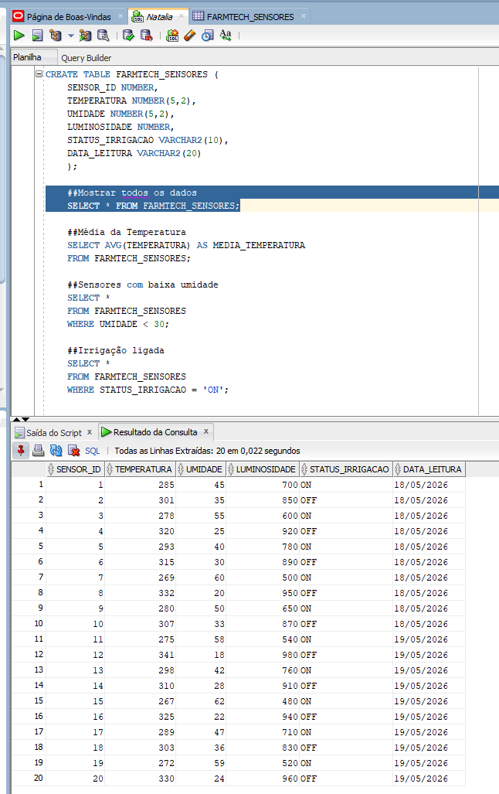
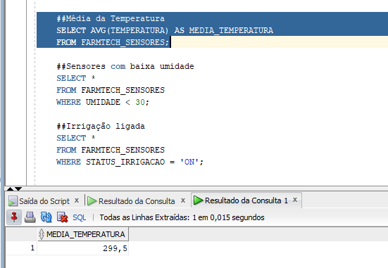
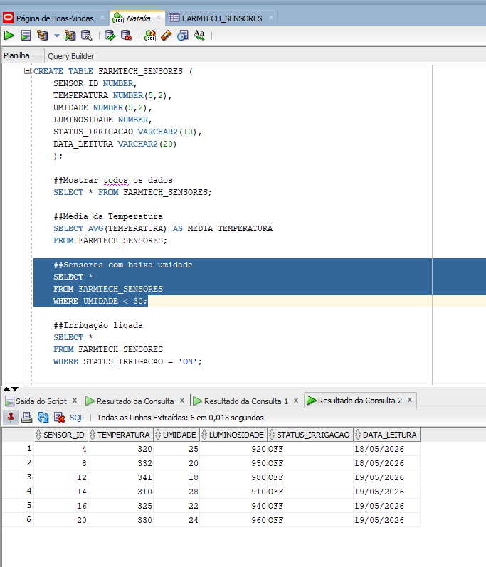
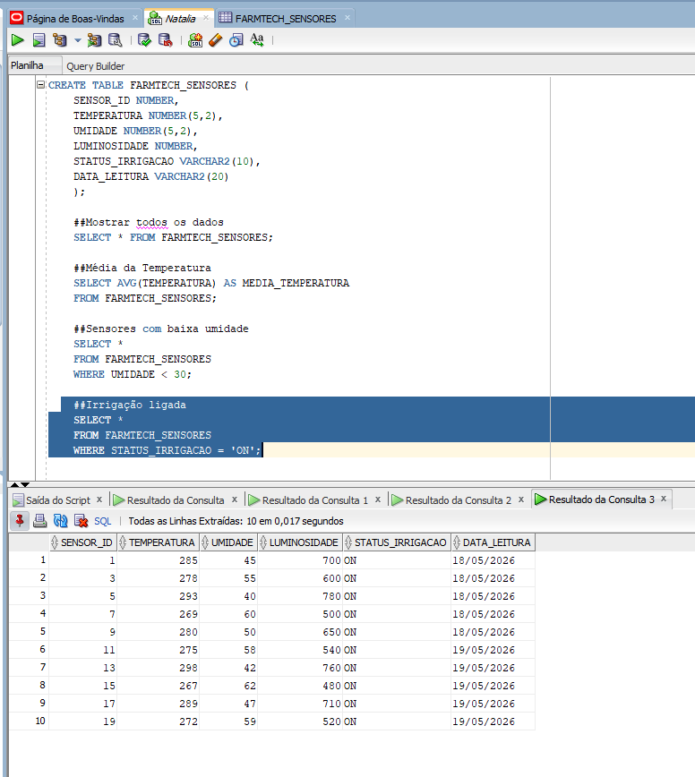

# FIAP - Faculdade de Informática e Administração Paulista

# 🌱 FarmTech Solutions - Fase 3 Banco de Dados

---

# 👥 Integrantes
- Natalia Faro - RM 568610

---

# 📜 Descrição do Projeto
O projeto FarmTech Solutions foi desenvolvido como parte do Project Based Learning (PBL) da FIAP, com foco em Agricultura 4.0 e utilização de tecnologias inteligentes no agronegócio.
Nesta Fase 3 do projeto, foi implementado um banco de dados Oracle para armazenamento, organização e análise de dados provenientes de sensores agrícolas simulados desenvolvidos nas fases anteriores do projeto.
Os dados representam informações coletadas por sensores IoT utilizados em sistemas inteligentes de irrigação agrícola, permitindo monitoramento e futura aplicação de Machine Learning no agronegócio.

As informações armazenadas incluem:

- Temperatura
- Umidade
- Luminosidade
- Status da irrigação
- Data da leitura

---

# 🛠 Tecnologias Utilizadas
- Oracle Database
- Oracle SQL Developer
- SQL
- CSV
- GitHub
- ESP32
- IoT

---

# 📂 Estrutura de Pastas

```bash
etapas-maquina-agricola/
│
├── assets/
│   └── print/
│       ├── baixa_umidade.png
│       ├── irrigacao_ligada.png
│       ├── media_temperatura.png
│       └── mostrar_dados.png
│
├── scripts/
│   ├── consultas.sql
│   ├── dados_sensores.csv
│   └── dados_sensores.xlsx
│
├── video/
│   └── link_video.txt
│
└── README.md
```

---

# ⚙️ Como Executar o Projeto

## 1. Criar a tabela Oracle

Executar o script SQL abaixo no Oracle SQL Developer:

```sql
CREATE TABLE FARMTECH_SENSORES (
    SENSOR_ID NUMBER,
    TEMPERATURA NUMBER(5,2),
    UMIDADE NUMBER(5,2),
    LUMINOSIDADE NUMBER,
    STATUS_IRRIGACAO VARCHAR2(10),
    DATA_LEITURA VARCHAR2(20)
);
```

---

## 2. Importar os Dados

Importar o arquivo:

```text
dados_sensores.csv
```

Configurações utilizadas:

- Formato: CSV
- Codificação: UTF8
- Delimitador: ;
- Cabeçalho habilitado

---

## 3. Executar as Consultas

As consultas estão disponíveis no arquivo:

```text
scripts/consultas.sql
```

---

# 📊 Consultas Realizadas

## 🔹 Mostrar todos os dados

```sql
SELECT * FROM FARMTECH_SENSORES;
```

### Resultado



---

## 🔹 Média de Temperatura

```sql
SELECT AVG(TEMPERATURA) AS MEDIA_TEMPERATURA
FROM FARMTECH_SENSORES;
```

### Resultado



---

## 🔹 Sensores com baixa umidade

```sql
SELECT *
FROM FARMTECH_SENSORES
WHERE UMIDADE < 30;
```

### Resultado



---

## 🔹 Irrigação Ligada

```sql
SELECT *
FROM FARMTECH_SENSORES
WHERE STATUS_IRRIGACAO = 'ON';
```

### Resultado



---

# 🚀 Resultados Obtidos

O projeto permitiu:

- Criação de banco de dados Oracle;
- Organização estruturada de dados agrícolas;
- Importação de arquivos CSV;
- Execução de consultas SQL;
- Simulação de integração entre sensores IoT e banco de dados;
- Estruturação de base para futuras aplicações de Machine Learning.

---

# 📦 Histórico de Versões

- 0.1.0 - Estrutura inicial do projeto
- 0.2.0 - Criação da base Oracle
- 0.3.0 - Importação dos dados CSV
- 0.4.0 - Desenvolvimento das consultas SQL
- 0.5.0 - Documentação e evidências

---

# 🎥 Vídeo Demonstrativo

Link do vídeo demonstrativo no YouTube:

```text
Adicionar link do vídeo aqui
```

---

# 📄 Licença
Projeto acadêmico desenvolvido para fins educacionais na FIAP.
